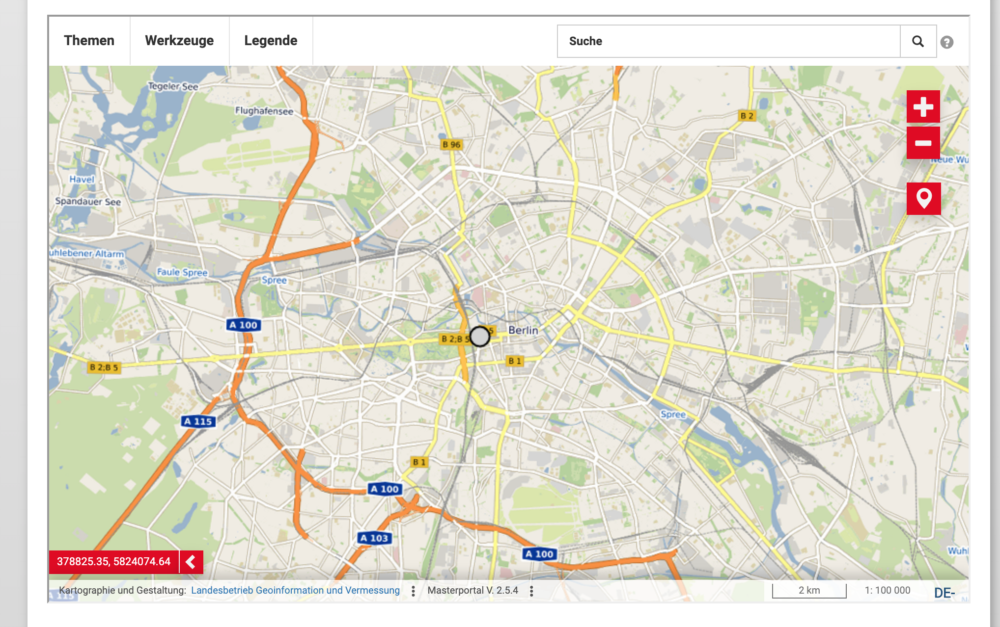
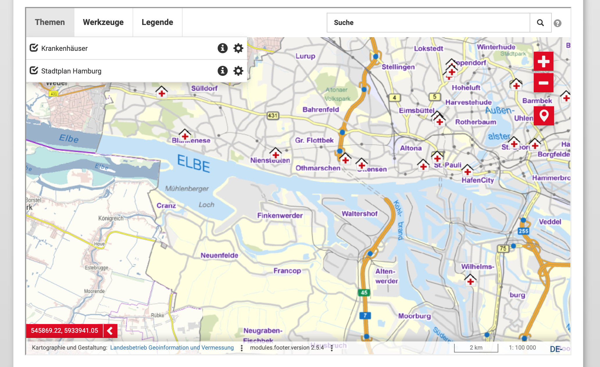

# Installation
1) Download the code in this repository: [Download Zip](https://github.com/mobility-data-hub-berlin/masterportal-wordpress/archive/master.zip)  
2. Install plugin - two alternatives  
2.1 **Upload via SSH/FTP (recommended)**: Unzip the package from step 1 and upload its contents onto your wordpress server in the plugin directory  
2.2 Upload via Wordpress UI: Click on Plugins -> Install -> upload the ZIP from step (as this plugin is rather large, it may be that you hit your HTTP servers request size limit - make sure to configure it correctly or use the upload via FTP/SSH)  

# Configuration
For alle configuration options, please refer to the official Masterportal repository and its documentation: [Masterportal docs](https://bitbucket.org/geowerkstatt-hamburg/masterportal/src/stable/doc/doc.md).
In general, the Masterportal differentiates between two configs: the global config and the portal-specific config. Please also refer to [this](https://bitbucket.org/geowerkstatt-hamburg/masterportal/src/2961d1ec919fcf3721909e56b51d390da49decf5/doc/Konfig-%C3%9Cberblick.png) illustration to understand the concept of global and portal-specific configurations (unfortunately, German only).
## Global configuration
The global configuration resides in the `config` folder as follows:
```
config
--- rest-services-internet.json
--- services-internet.json
--- styles_v3.json
```

## Portal specific configuration
Every portal you create (in the example there are `berlin` and `hamburg`) has its own configuration inside its own folder - the structure is as follows:
```
public
--- portals
------ berlin
--------- config.js
--------- config.json
--------- index.html
------ hamburg
--------- config.js
--------- config.json
--------- index.html
```

To create more portals, you can just duplicate existing folders.
You need to edit the files in those folders, but be careful: There are a lot of relative paths inside those files, that point to the `mastercode` folder. Do not just replace the entire file, but make deliberate choices what to change and what not.

# Usage
The plugin introduces a shortcode that you can include into any Wordpress page like this:

```
[masterportal portal_name="berlin" layer_ids="berlin_city,brandenburger_tor" lng="de"]
```

- `portal_name` (required) references the specific portal you want to show on that page (in this example either `hamburg` or `berlin`)
- `layer_ids` (optional) references the specific layers you want to have selected in the masterportal (the layer ids are configured in `services-internet.json` and the corresponding `config.json`). If omitted, it shows the layers you have configured in your portal specific config.
- `lng` (optional) the language the masterportal should use. `de` if omitted. The Masterportal uses https://github.com/i18next/i18next-browser-languageDetector


The code above would result in something like this:


If you chose to use `portal_name=hamburg`, then you would see something like this:



# Credits
This plugin (obviously) heavily relies on the Masterportal and just encapsulates it into a Wordpress plugin. Thus, credit for the application goes to the devs of Masterportal - stop by: https://bitbucket.org/geowerkstatt-hamburg/masterportal/src/dev/
